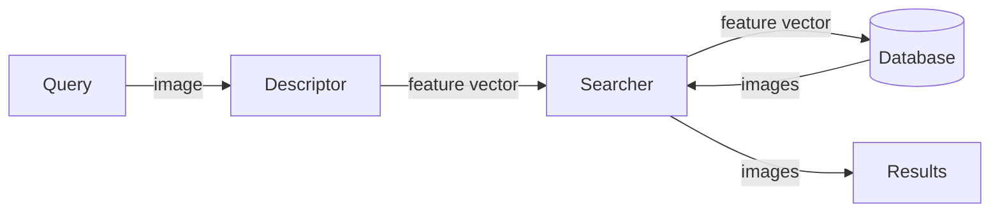

# FathomMap

:simple-github: [source code](https://github.com/owenmastropietro/fathommap)

---

## Overview


_Underwater Content-Based Image Retrieval._



**FathomMap** is a Content-Based Image Retrieval (CBIR) framework designed to
evaluate and compare multiple retrieval pipelines for underwater imagery.
The project explores how different _Descriptors_ (feature extractors) and
_Searchers_ affect retrieval accuracy and efficiency, with a particular focus on
leveraging learned representations from the
**[FathomView](../../../pages/code/projects/fathomview.md)** UNet model - a previous project for
enhancing underwater images.

Given a query image, FathomMap first extracts a compact feature vector using an
image _Descriptor_ (e.g., UNet-based encoder, pretrained ResNet18, HE).
These feature vectors are then compared against a database of precomputed
desciptors using an image _Searcher_ (e.g., linear search or indexing with
FAISS and inverted K-Means clustering).

A key motivation for this project is to assess whether a UNet trained for
underwater image enhancement can also serve as an effective semantic descriptor
for retrieval, compared against more conventional CNN-based or classical approaches.

The overall system architecture is illustrated above, highlighting the separation
of feature extraction, image/feature storage and similarity search.

---

## Results

_The following MSE and MS-SSIM metrics are explained more in my complementary
project - [FathomView](../../../pages/code/projects/fathomview.md) - where they were used
to compose a loss function for training a custom UNet model to enhance underwater images._


This figure evaluates the accuracy of selected image descriptors.  
FathomMap's UNet Descriptor outperforms other approaches.  
The plot on the right shows the degree of similarity between the query image and the returned images.  
The plots comparing MSE and MS-SSIM reinforce this evaluation by showing the
model's attention to both pixel-level (MSE) and structural (MS-SSIM) similarities.

---


This figure evaluates the efficiency of selected image searchers/index strategies.  
The key take-away here is that FAISS outperforms inverted K-Means for UNet descriptors
because the enhancement-trained UNet features are highly correlated and poorly clustered,
while ResNet's features are semantically separable and benefit more from clister-based pruning.  
This illustrates the importance in separating the image descriptors and searchers for evaluation.

---

## Key Components

---

### Descriptors

`#!python class fathommap.descriptors.Base(ABC)`  
`#!python class fathommap.descriptors.UNet(Base)`  
`#!python class fathommap.descriptors.ResNet(Base)`  
`#!python class fathommap.descriptors.Histogram(Base)`

=== "Descriptor API"

    ``` py
    # Abstract base class for Content-Based Image Retrieval (CBIR) descriptors.

    class BaseDescriptor(ABC):

        @abstractmethod
        def describe(self, image: np.ndarray) -> np.ndarray:
            # Returns features extracted from the given `image`.

        @property
        @abstractmethod
        def name(self) -> str:
            # Returns the name of the descriptor.
    ```

=== "UNet"

    ``` py
    class UNetDescriptor(BaseDescriptor):

        def __init__(self, model_path):
            unet = Unet()
            unet.load_state_dict(torch.load(model_path))
            unet.eval()
            transform = transforms.Compose([
                transforms.ToPILImage(),
                transforms.ToTensor(),
                transforms.Resize((224, 224)),
                transforms.Normalize(
                    mean=[0.5, 0.5, 0.5],
                    std=[0.5, 0.5, 0.5],
                )
            ])

            self.unet = unet
            self.transform = transform

        def describe(self, image: np.ndarray) -> np.ndarray:

            _image = copy.deepcopy(image)
            _image = cv2.cvtColor(_image, cv2.COLOR_BGR2RGB)
            _image = self.transform(_image)
            _image = _image.unsqueeze(0)

            with torch.no_grad():
                features = self.unet(_image)

            features = features.flatten().numpy()

            return features
    ```

=== "ResNet 18"

    ``` py
    class ResNetDescriptor(BaseDescriptor):

        def __init__(self):
            resnet = models.resnet18(weights=models.ResNet18_Weights.DEFAULT)
            resnet.eval()
            transform = transforms.Compose([
                transforms.ToPILImage(),
                transforms.Resize((224, 224)),
                transforms.ToTensor(),
                transforms.Normalize(  # normalize with ImageNet values
                    mean=[0.485, 0.456, 0.406],
                    std=[0.229, 0.224, 0.225]
                ),
            ])

            self.resnet = resnet
            self.transform = transform

        def describe(self, image: np.ndarray) -> np.ndarray:

            _image = copy.deepcopy(image)
            _image = cv2.cvtColor(_image, cv2.COLOR_BGR2RGB)
            _image = self.transform(_image)
            _image = _image.unsqueeze(0)

            with torch.no_grad():
                features = self.resnet(_image)

            features = features.flatten().numpy()

            return features
    ```

=== "Histogram"

    ``` py
    class HistDescriptor(BaseDescriptor):

        def __init__(self, bins):
            self.bins = bins

        def describe(self, image: np.ndarray) -> np.ndarray:

            _image = copy.deepcopy(image)
            _image = cv2.cvtColor(_image, cv2.COLOR_BGR2HSV)
            features = []

            # Divide the image into four segments and an elliptical center.
            (h, w) = _image.shape[:2]
            (cx, cy) = (int(w * 0.5), int(h * 0.5))  # center point
            segments = [
                (0, cx, 0, cy),  # top left
                (cx, w, 0, cy),  # top right
                (cx, w, cy, h),  # bottom right
                (0, cx, cy, h),  # bottom left
            ]
            (ax, ay) = (int(w * 0.75) // 2, int(h * 0.75) // 2)
            ellipse_mask = np.zeros(_image.shape[:2], dtype="uint8")
            cv2.ellipse(ellipse_mask, (cx, cy), (ax, ay), 0, 0, 360, 255, -1)

            # Compute Histogram for Corner Segments.
            for (x0, xf, y0, yf) in segments:
                corner_mask = np.zeros(_image.shape[:2], dtype="uint8")
                cv2.rectangle(corner_mask, (x0, y0), (xf, yf), 255, -1)
                corner_mask = cv2.subtract(corner_mask, ellipse_mask)

                hist = self.histogram(_image, corner_mask)
                features.extend(hist)

            # Compute Histogram for Elliptical Center.
            hist = self.histogram(_image, ellipse_mask)
            features.extend(hist)
            features = np.array(features)

            return features

        def histogram(self, image, mask):

            hist = cv2.calcHist(
                images=[image],
                channels=[0, 1, 2],
                mask=mask,
                histSize=self.bins,
                ranges=[0, 180, 0, 256, 0, 256],
            )

            # Normalize the Histogram According to OpenCV Version.
            if imutils.is_cv2():  # OpenCV 2.4
                hist = cv2.normalize(hist).flatten()
            else:  # OpenCV 3+
                hist = cv2.normalize(hist, hist).flatten()

            return hist
    ```

**Descriptors** are responsible for converting an input image into a fixed-length feature vector that captures visual or semantic information suitable for similarity search.

#### UNet

Uses a UNet model trained for underwater image enhancement as a learned feature extractor. The model output is flattened to form a high-dimensional descriptor, capturing scene structure and color characteristics tailored to underwater imagery.

#### ResNet

Leverages a pretrained ResNet-18 model to extract deep semantic features learned from large-scale natural image datasets. Serves as a strong general-purpose baseline for CNN-based image retrieval.

#### Histogram

Computes spatially-aware HSV color histograms over image regions. This hand-crafted descriptor provides a lightweight, interpretable baseline that emphasizes global color distribution rather than semantic content.

---

### Searchers

`#!python class fathommap.searchers.Base(ABC)`  
`#!python class fathommap.searchers.Brute(Base)`  
`#!python class fathommap.searchers.FaissFlatIp(Base)`  
`#!python class fathommap.searchers.InvertedKMeans(Base)`

=== "Searcher API"

    ``` py
    # Abstract base class for Content-Based Image Retrieval (CBIR) searchers.

    class BaseSearcher(ABC):

        def __init__(self, similarity_fn: Callable[[np.ndarray, np.ndarray], float]):
            self.similarity_fn = similarity_fn

        @abstractmethod
        def search(
            self,
            query_vector: np.ndarray,
            limit: int = 10
        ) -> list[tuple[str, float]]:
            # Returns the top `limit` most similar items to the given `query_vector`.

        @abstractmethod
        def build_index(self, features_path: str) -> None:
            # Builds the internal data structure required for similarity search.
    ```

=== "Brute Force"

    ``` py
    class BruteForceSearcher:

        def __init__(self, similarity_fn):
            self.similarity_fn = similarity_fn
            self.labels = None
            self.features = None

        def search(
            self,
            query_vector: np.ndarray,
            limit: int = 10
        ) -> list[tuple[str, float]]:
            # Compute similarities without FAISS Index.
            results = [  # (label, similarity)
                (label, self.similarity_fn(features, query_vector))
                for label, features in zip(self.labels, self.features)
            ]
            # Reverse Sort Results by Similarity Value.
            results.sort(key=lambda item: item[1], reverse=True)

            return results[:limit]

        def build_index(self, feature_path):
            self.labels = []
            self.features = []
            with open(feature_path, "r", encoding="utf-8") as f:
                reader = csv.reader(f)
                _ = next(reader)  # header
                for label, *features in reader:
                    self.labels.append(label)
                    self.features.append([float(x) for x in features])
    ```

=== "FAISS FLAT IP"

    ``` py
    class FaissFlatIPSearcher:

        def __init__(self, similarity_fn=None):
            self.similarity_fn = similarity_fn
            self.labels = None
            self.index = None

        def search(
            self,
            query_vector: np.ndarray,
            limit: int = 10,
        ) -> list[tuple[str, float]]:
            query_vector = np.array(query_vector).astype("float32").reshape(1, -1)
            faiss.normalize_L2(query_vector)

            distances, indices = self.index.search(
                query_vector,
                k=limit or len(self.labels),
            )

            results = [
                (self.labels[i], distances[0][rank])
                for rank, i in enumerate(indices[0])
            ]

            return results[:limit]

        def build_index(self, feature_path: str) -> None:
            labels = []
            features = []
            with open(feature_path, "r", encoding="utf-8") as f:
                reader = csv.reader(f)
                _ = next(reader)  # header
                for label, *_features in reader:
                    labels.append(label)
                    features.append([float(x) for x in _features])

            self.labels = labels  # todo: this won't work for loading saved index
            features = np.array(features).astype("float32")
            faiss.normalize_L2(features)
            self.index = faiss.IndexFlatIP(features.shape[1])
            self.index.add(features)
    ```

=== "Inverted KMeans Clustering"

    ``` py
    from sklearn.cluster import KMeans
    from sklearn.preprocessing import normalize


    class InvertedSearcher:

        def __init__(self, similarity_fn=None, n_clusters: int = 10):
            self.similarity_fn = similarity_fn
            self.n_clusters = n_clusters
            self.index = defaultdict(list)  # cluster_id -> [(label, vector), ...]
            self.kmeans = None
            self.labels = None

        def search(
            self,
            query_vector: np.ndarray,
            limit: int = 10,
            probe: int = 3,
        ) -> list[tuple[str, float]]:
            query_vector = normalize(query_vector.reshape(1, -1), norm="l2")[0]

            # Find `probe` nearest centroids.
            centroids = normalize(self.kmeans.cluster_centers_, norm="l2")
            similarities = centroids @ query_vector.T  # cosine similarity
            top_cluster_ids = np.argsort(similarities)[-probe:][::-1]

            # Search within the selected clusters.
            results = []
            for cid in top_cluster_ids:
                for label, vec in self.index[cid]:
                    sim = np.dot(query_vector, vec)  # cosine similarity
                    results.append((label, sim))

            results.sort(key=lambda x: x[1], reverse=True)
            return results[:limit]

        def build_index(self, feature_path: str) -> None:
            labels = []
            features = []
            with open(feature_path, "r", encoding="utf-8") as f:
                reader = csv.reader(f)
                _ = next(reader)  # header
                for label, *_features in reader:
                    labels.append(label)
                    features.append([float(x) for x in _features])

            self.labels = labels
            features = np.array(features).astype("float32")
            features = normalize(features, norm="l2")  # normalize for cosine

            self.kmeans = KMeans(n_clusters=self.n_clusters, random_state=42)
            cluster_ids = self.kmeans.fit_predict(features)

            self.index = defaultdict(list)
            for label, vec, cid in zip(labels, features, cluster_ids):
                self.index[cid].append((label, vec))
    ```

**Searchers** operate over a collection of stored feature vectors and return the most similar items to a given query vector.

#### Brute Force

Computes similarity between the query vector and every feature vector in the database. While simple and exact, this approach does not scale well to large datasets.

#### FAISS Flat Inner Product

Uses Facebook AI Similarity Search (FAISS) with L2-normalized vectors and inner-product similarity for efficient exact nearest-neighbor search. Provides significantly faster queries while maintaining exact results.

#### Inverted K-Means Clustering

Partitions feature vectors into clusters using K-Means and restricts search to the most relevant clusters at query time. This approximate approach improves scalability by reducing the number of comparisons required per query.

---
