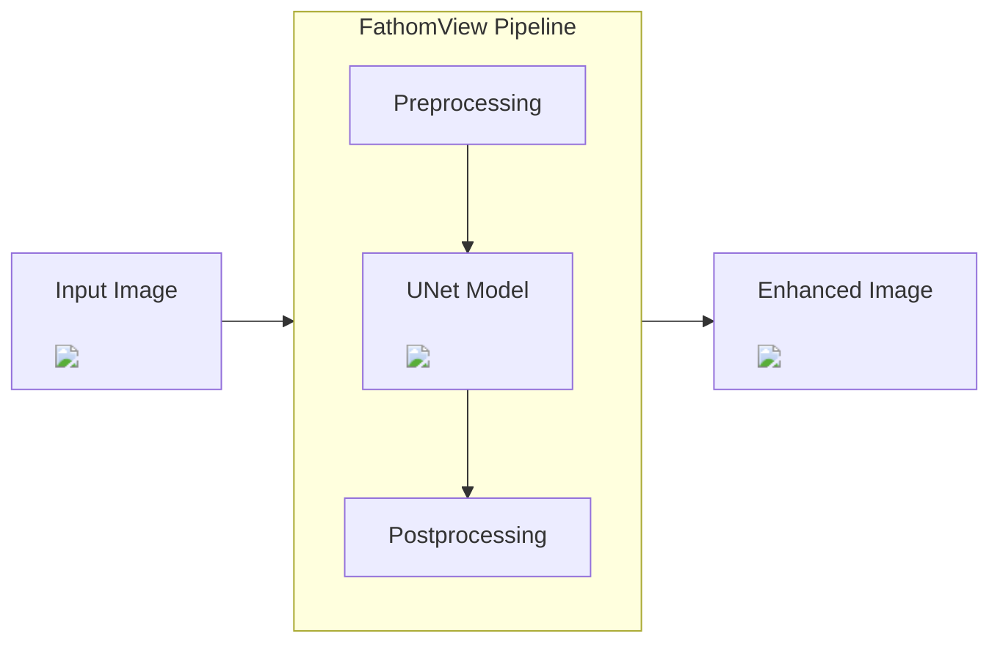
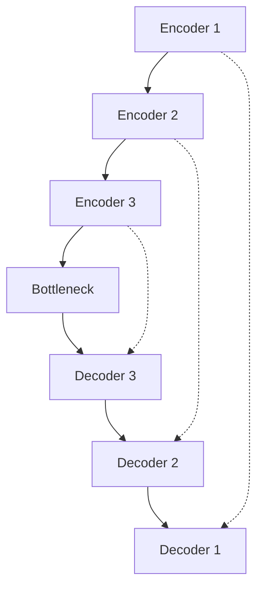

# FathomView

:simple-github: [source code](https://github.com/owenmastropietro/fathomview)

---

## Overview


_Underwater Image Enhancement using Deep Convolutional Neural Networks._



**FathomView** implements a convolutional _UNet-style_ encoder-decoder architecture to enhance underwater images by correcting color distortion, low contrast, and blurriness caused by light absorption and scattering in underwater environments.

The model is trained using supervised learning on paired datasets of underwater images and their corresponding enhanced versions, learning a direct image-to-image mapping to restore visual quality. Spatial detail is preserved through _skip connections_ between encoder and decoder layers.

**FathomView**'s U-Net architecture is compared against other models including traditional baselines and other deep learning approaches, demonstrating superior performance in terms of PSNR and SSIM metrics on benchmark underwater image datasets.

---

## Results


/// caption
Comparing FathomView's output across datasets.  
Left: Trained on EUVP dataset.  
Right: Trained on LSUI dataset.
///

| Metric | FathomView | UCM   | HE     | MSRCR | Fusion | UDCP  | IBLA  | UGAN  | WaterGAN |
| ------ | ---------- | ----- | ------ | ----- | ------ | ----- | ----- | ----- | -------- |
| `MSE`  | 0.002      | 0.029 | 0.045  | 0.059 | 0.027  | 0.072 | 0.058 | 0.026 | 0.014    |
| `PSNR` | 30.31      | 20.68 | 18.315 | 13.25 | 23.13  | 17.37 | 19.10 | 20.63 | 20.25    |
| `SSIM` | 0.966      | 0.869 | 0.845  | 0.580 | 0.933  | 0.847 | 0.832 | 0.779 | 0.842    |

/// caption
**FathomView** achieves the best performance in both PSNR and SSIM metrics, indicating better visual quality and detail preservation in enhanced images.
///

---

## Key Components

---

### UNet Architecture

`#!python class torch.nn.Module`  
`#!python class fathomview.models.UNet(nn.Module)`

=== "UNet.\_\_init\_\_()"

    ``` py
    def __init__(self, in_channels: int, out_channels: int, init_features: int):

        x = init_features
        self.pool = nn.MaxPool2d(kernel_size=2, stride=2)

        self.e1 = conv_block(in_channels, x)              # 3 => 32
        self.e2 = conv_block(x, x * 2)                    # 32 => 64
        self.e3 = conv_block(x * 2, x * 4, dropout=True)  # 64 => 128

        self.b = conv_block(x * 4, x * 8, dropout=True)   # 128 => 256

        self.uc3 = nn.ConvTranspose2d(x * 8, x * 4, kernel_size=2, stride=2)  # 256 => 128
        self.uc2 = nn.ConvTranspose2d(x * 4, x * 2, kernel_size=2, stride=2)  # 128 => 64
        self.uc1 = nn.ConvTranspose2d(x * 2, x, kernel_size=2, stride=2)      # 64 => 32
        self.d3 = conv_block(x * 8, x * 4)
        self.d2 = conv_block(x * 4, x * 2)
        self.d1 = conv_block(x * 2, x)

        self.conv = nn.Conv2d(x, out_channels, kernel_size=1)
    ```

=== "UNet.forward()"

    ``` py
    def forward(self, x: torch.Tensor) -> torch.Tensor:

        # Encoder (downsampling with max pooling)
        enc1 = self.encoder1(x)
        enc2 = self.encoder2(self.pool(enc1))
        enc3 = self.encoder3(self.pool(enc2))

        # Bottleneck
        bottleneck = self.bottleneck(self.pool(enc3))

        # Decoder (upsampling with transposed convolutions)
        dec3 = self.upconv3(bottleneck)
        dec3 = torch.cat((dec3, enc3), dim=1)  # skip connection
        dec3 = self.decoder3(dec3)
        dec2 = self.upconv2(dec3)
        dec2 = torch.cat((dec2, enc2), dim=1)  # skip connection
        dec2 = self.decoder2(dec2)
        dec1 = self.upconv1(dec2)
        dec1 = torch.cat((dec1, enc1), dim=1)  # skip connection
        dec1 = self.decoder1(dec1)

        return self.conv(dec1)
    ```

=== "conv_block()"

    ``` py
    def conv_block(in_channels, features, dropout=False):

        layers = [
            nn.Conv2d(in_channels, features, kernel_size=3, padding=1, bias=False),

            nn.ReLU(inplace=True),

            nn.Conv2d(features, features, kernel_size=3, padding=1, bias=False),

            *( [nn.Dropout2d(0.3)] if dropout else []),  # optional dropout layer

            nn.ReLU(inplace=True),
        ]

        return nn.Sequential(*layers)
    ```

The **UNet** class implements a standard encoder-decoder architecture with skip connections, originally introduced in ([Ronneberger, Fischer, and Brox, 2015](https://doi.org/10.48550/arXiv.1505.04597)) for biomedical image segmentation and adapted here for underwater image enhancement.

It features symmetric downsampling and upsampling paths, feature reuse via concatenated skip connections, and optional dropout for regularization in deeper layers.

<p align="center">
    
  <br>
  <em>The overall UNet-style architecture of this work.</em>
</p>

---

At a high level, the forward pass is responsible for defining a pass through the network with the following pipeline:

1. **Encoder**: Downsample input image via max pooling, reducing spatial dimensions while increasing feature depth.
2. **Bottleneck**: Highest-level feature representation; dropout applied to reduce overfitting.
3. **Decoder**: Upsampling via transposed convolutions to restore original spatial resolution; skip connections concatenate encoder features.

While the above figure demonstrates this pass through in context with the various operations performed at each layer, the following diagram illustrates a high level overview of the encode-decode process with skip-connections.

---



---

### Objective (Loss) Function

**L1 Loss** - Mean Absolute Error (MSE)

$$
L_{L1}(x, y) = \frac{1}{N}\sum_{i=0}^{N}\left|x_i - y_i\right|
$$

- Measures the average absolute difference between predicted (_x_) and ground truth (_y_) pixels.
- Encourages high PSNR and preserves overall color and luminance.
- Limitation: ignores structural and perceptual features of images.

---

**SSIM Loss** - Structural SIMilarity

$$
L_{SSIM}(x, y) = 1 - SSIM(x, y)
$$

where

$$
SSIM(x, y) = l(x, y)^\alpha * c(x, y)^\beta * s(x, y)^\gamma
$$

- `l(x, y)` - luminance comparison (mean intensity)
- `c(x, y)` - contrast comparison (standard deviation)
- `s(x, y)` - structure comparison (correlation between patterns)
- Exploits pixel inter-dependencies to evaluate structural similarity.

---

**MS SSIM Loss** - Multi-Scaled SSIM

$$
L_{MS-SSIM}(x, y) = 1 - \prod_{j=1}^{M}SSIM_j(x, y)
$$

- Computes SSIM over multiple scales (_j_) to capture both _local textures_ and _global structures_.
- More sensitive to perceptual differences across different resolutions.

---

**FathomView Loss**

$$
L_{FathomView}(x, y) = L_{L1}(x, y) + L_{MS-SSIM}(x, y)
$$

- Combines pixel-level accuracy (_L1_) with perceptual and structural similarity (_MS-SSIM_).
- Encourages enhanced images to maintain brightness, color, and structure.

---
