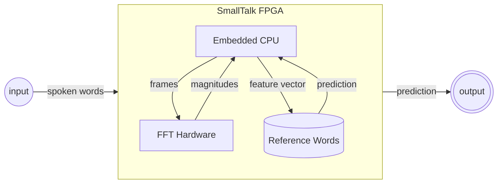
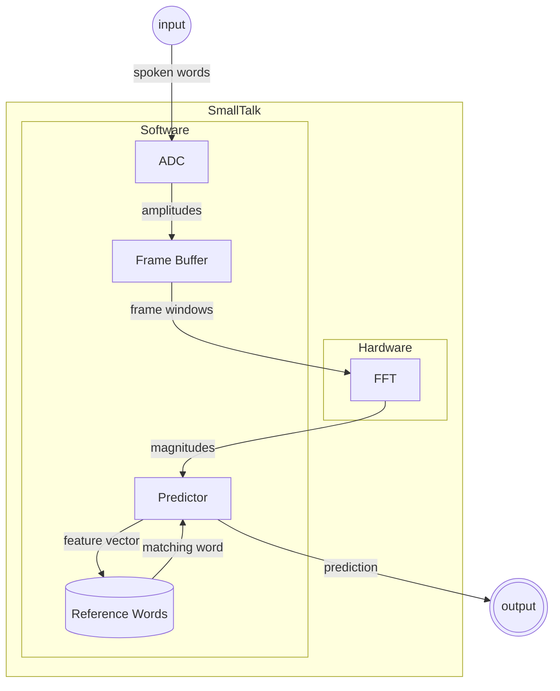
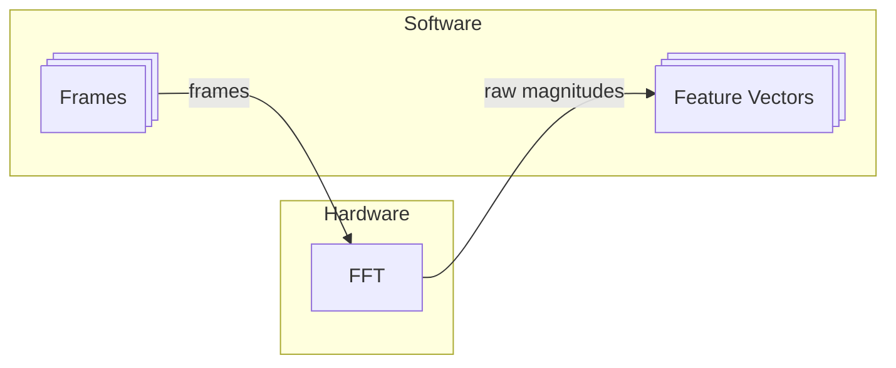
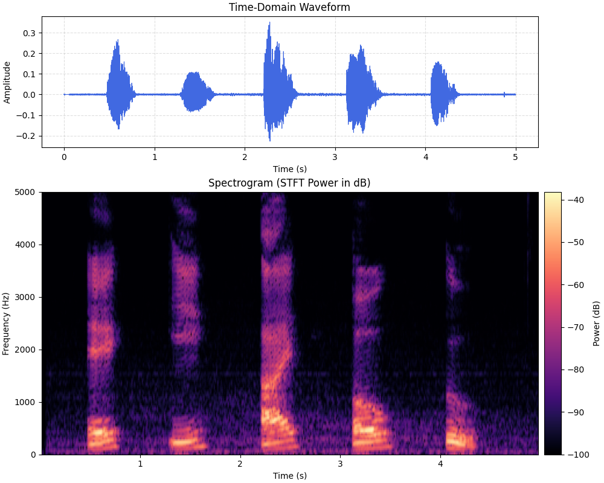
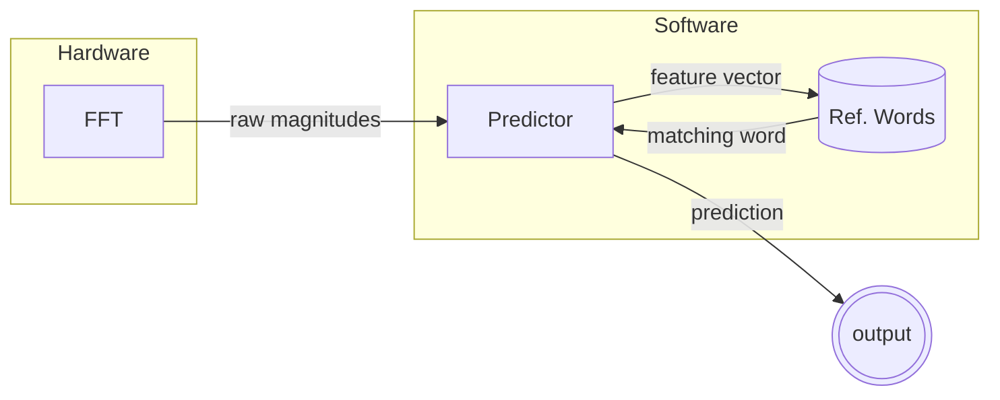

# SmallTalk

:simple-github: [source code](https://github.com/owenmastropietro/smalltalk)

---

## Overview

_FPGA-accelerated speech recognition using FFT-based feature extraction._



**SmallTalk** implements an embedded speech recognition system that offloads
computationally intensive signal processing to an FPGA while retaining flexible
control logic on the embedded Nios II soft processor (CPU).
Spoken audio is transformed into frequency-domain features using a hardware FFT
pipeline, then matched against a small reference dictionary to classify words.

This project explores:

- hardware / software integration
- FPGA acceleration for DSP
- Real-time audio preprocessing and inference

A more in-depth diagram of the hardware/software components:



---

## Results

!!! warning

    todo: not sure the best way to demo results yet...

---

## Key Components

---

### Audio Frontend

The FPGA features an embeded [Nio II](https://www.altera.com/design/guidance/nios-ii-bare-metal-developer)
soft processor and an on-board [WM8731](https://cdn.sparkfun.com/datasheets/Dev/Arduino/Shields/WolfsonWM8731.pdf)
Audio Codec with an Analog-to-Digital Converter which digitizes the microphone input.
Audio preprocessing is thus performed in a software (C++) kernel which maps the
microphone's analog signal to a stream of 16b PCM amplitude samples.
These samples are then buffered into fixed-size (1024 samples) frames.
A [Hann](https://en.wikipedia.org/wiki/Hann_function) windowing function is
applied to the audio frames to ensure time-localized frequency analysis.

At this point, a frame of audio is represented as an `#!c++ int16_t frame[1024]`.  
The FFT expects a sequence of complex values,
so frames are converted to `#!c++ std::complex<double> frame[1024]`.

These complex frames are then fed into the [VHDL](https://en.wikipedia.org/wiki/VHDL)-defined
hardware components that compose the FFT - described in the next section.

??? info "Diagram: WM8731 Audio Codec"

    

---

### FFT Accelerator

The FFT kernel implements a simple 1024-point radix-2 iterative [Cooley-Tukey FFT](https://en.wikipedia.org/wiki/Cooley%E2%80%93Tukey_FFT_algorithm).  
Responsible for mapping time-domain samples to frequency-domain magnitudes,
the hardware-defined FFT offloads the most compute-heavy stage from the CPU,
enabling near real-time processing.

The FFT kernel is composed of two components, namely the **FFT Organizer** and the
**Butterfly Unit**.  
The FFT _organizer_ is responsible for orchestrating / wiring
together the butterfly units. It divides the input sequence (frame) -
representing an $N$-point FFT - into $\log_{2} N$ stages. Each stage performs a
set of $\frac{N}{2}$ independent _butterfly_ operations which recombine the
recursive work.  
The _butterfly_ units are responsible for computing a _butterfly operation_
defined by the following equations - using 2 complex adders/subtractors and
1 complex multiplier which maps to about 10 basic arithmetic units depending on
your implementation of the complex multiplier.

Butterfly operation:

$$
y_0 = x_0 + x_1 w^k_n \\
y_1 = x_0 - x_1 w^k_n
$$

where $w^k_n = e^{-2πk/n}$ represents the _twiddle factor_. It is important to
note that $e^{-2π/n}$ is a primitive $n$th root of 1.
Using Euler's roots of unity, we can precompute all such _twiddle factors_ for a
given $N$-point FFT. These precomputed values are stored in ROM.

!!! info "1024-point FFT"

    I use a frame of 1024 samples as input to the FFT.<br>
    This creates $\log_{2} 1024 = 10$ stages.<br>
    Each stage has $\frac{1024}{2} = 512$ butterflies.

    Thus, to compute this 1024-point FFT, the organizer must wire together
    $10 \cdot 512 = 5120$ butterfly units.

!!! example "Pseudocode"

    <div class="grid" markdown>

    ```vhdl title="4-point FFT" linenums="1"
    ...
    architecture rtl of fft4 is
        signal s1r, s1i : signed_array;
        signal tw_r3, tw_i3 : signed(15 downto 0);
    begin
        -- twiddle multiply for W4^1 = -j
        tw_r3 <=  s1i(3);
        tw_i3 <= -s1r(3);

        -- stage 1
        b0: entity butterfly port map(...);
        b1: entity butterfly port map(...);

        -- stage 2 (twiddle multiply for W4^1 = -j)
        -- (-j)*x = (xi, -xr)
        b2: entity butterfly port map(...);
        b3: entity butterfly port map(...);
    end architecture;
    ```

    ```vhdl title="Butterfly Unit" linenums="1"
    entity butterfly is
        port (
            a_real, a_imag  : in signed(15 downto 0); -- A
            b_real, b_imag  : in signed(15 downto 0); -- B
            w_real, w_imag  : in signed(15 downto 0); -- W

            y0_real, y0_imag : out signed(15 downto 0); -- A + BW
            y1_real, y1_imag : out signed(15 downto 0); -- A - BW
        );
    end butterfly;
    ```

    </div>

---

### Feature Extraction



After passing the input signal (audio frames) through the FFT, we obtain the FFT
magnitudes which act as a simple spectal representation of spoken words that are
robust to timing variations.

In practice, these raw FFT magnitudes are used to compute Mel-filterbank energies
or, a step further, to compute MFCCs. However, I chose to simply use the raw FFT
magnitudes to analyse the accuracy of such a baseline so that I could evaluate the
extent to which the extra compute for MFs or MFCCs translates to increased accuracy.

That is, I use the raw FFT magnitudes as my feature vector.

To illustrate the process so far (i.e., record speech, buffer frames, compute FFT),
I recorded myself speaking the english vowels (a, e, i, o, u) and fed it through
the pipeline. The resulting plots are shown below.


/// caption
Top: time-domain plot (stream of amplitude values).<br>
Bottom: frequency-domain plot (windowed FFT magnitudes).
///

---

### Predictor



The predictor compares the extracted feature vectors against a reference word
database, using distance-based matching (e.g., L2 / cosine similarity),
and outputs the closest matching word.

---

## Why FFT for Speech?

Human hearing is largely based on characteristics derived from the frequency
domain (e.g., pitch, tone, timbre, etc.). Speech signals are more structured in
the frequeny-domain where different phonemes and words exhibit different spectral
patterns. This makes the FFT-derived features far more discriminative than raw
time-domain samples.


/// caption
Illustration of phonemes spoken by different people (top vs. bottom).
///

**SmallTalk** demonstrates the FFT in a practical embedded context.  
For a deeper dive into the FFT algorithom, check out my other project,
[ParallelFFT](../projects/parallel-fft.md), which implements the FFT (in software)
to analyze performance and parallelization.

---
