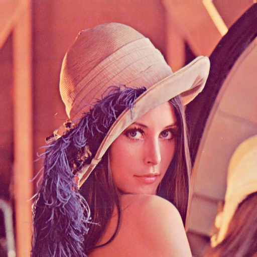
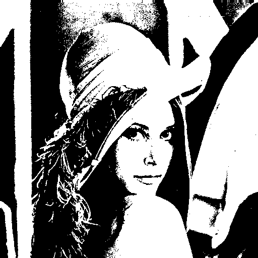
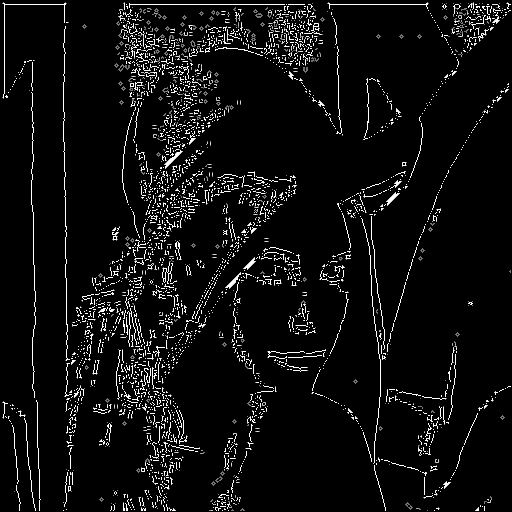
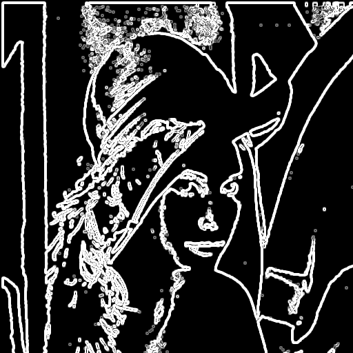
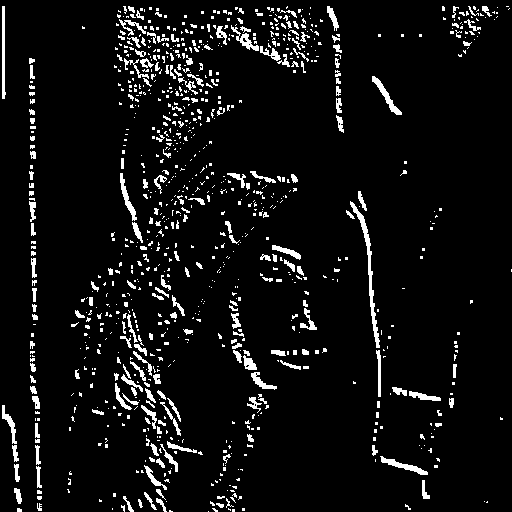
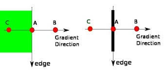
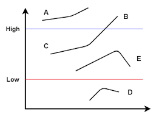

# CVL

:simple-github: [source code](https://github.com/owenmastropietro/cvl)

---

## Overview

**CVL** is a small Computer Vision Library implemented in C that demonstrates image processing on raster images. It supports [Netpbm]() image formats (PBM, PGM, PPM) and various image processing pipelines including thresholding, filtering, connected component labeling, and edge detection.

## Examples

### Performing Canny Edge Detection

```c
#include "cvl_imgproc.h"
#include "cvl_io.h"

int main(void) {
    Image img = cvl_imread("lena.ppm");
    Image binary = cvl_binarize_new(&img, 128);

    Matrix lena = cvl_img2mat(binary);

    const int sigma = 1;
    const int lo = 50;
    const int hi = 120;
    Matrix edges = cvl_canny_new(&lena, sigma, lo, hi);

    Image edges_img = cvl_mat2img(edges, 0, 1);

    cvl_imwrite("original.ppm", &img);
    cvl_imwrite("binary.pbm", &binary);
    cvl_imwrite("canny.pgm", &edges_img);

    // free memory...

    return 0;
}
```

<div class="gallery gallery--evolution">
    <figure>
        
        <figcaption>Original</figcaption>
    </figure>
    <figure>
        
        <figcaption>Binary Threshold</figcaption>
    </figure>
    <figure>
        
        <figcaption>Canny Edge Detection</figcaption>
    </figure>
</div>

### Applying a Sobel Filter to an Image

```c
int main(void) {
    Image img = cvl_imread("lena.ppm");
    Image bw = cvl_binarize_new(&img, 128);

    Matrix lena = cvl_img2mat(bw);
    Matrix lena_smooth = cvl_blur_new(&lena, 3);

    Matrix gx = cvl_mat_create(lena.height, lena.width);
    Matrix gy = cvl_mat_create(lena.height, lena.width);
    cvl_sobel(&lena_smooth, &gx, &gy);

    // Compute G and θ from Sobel Gradients (Gx, Gy).
    Matrix mags = cvl_sobel_mag(&lena_smooth);
    Matrix angs = cvl_sobel_angle(&lena_smooth);
    Image mags_img = cvl_mat2img(mags, 0, 1);
    Image angs_img = cvl_mat2img(angs, 0, 1);
    cvl_binarize(&angs_img, 3.14/2);

    cvl_imwrite("original.ppm", &img);
    cvl_imwrite("binary.pbm", &bw);
    cvl_imwrite("mags.pgm", &mags_img);
    cvl_imwrite("angles.pgm", &angs_img);

    // free memory...

    return 0;
}
```

<div class="gallery gallery--evolution">
    <figure>
        
        <figcaption>Original</figcaption>
    </figure>
    <figure>
        
        <figcaption>Binary Threshold</figcaption>
    </figure>
    <figure>
        
        <figcaption>Magnitude Representation</figcaption>
    </figure>
    <figure>
        
        <figcaption>Angle Representation</figcaption>
    </figure>
</div>

### Connected Component Labeling

```c
int main(void) {
    Image img = cvl_imread("text.pgm");
    cvl_binarize(&img, 128);

    Matrix labels = cvl_mat_create(img.height, img.width);

    cvl_imwrite("original.pbm", &img);

    int num_components = cvl_connected_components(&img, &labels, 4);
    printf("\nNumber of Components: %d\n", num_components);

    num_components = cvl_color_components(&img, &labels, 100);
    printf("\nNumber of Components: %d\n", num_components);

    cvl_imwrite("labeled-components.ppm", &img);

    // free memory...

    return 0;
}
```

Number of Components: 50 `// larger than 4`  
Number of Components: 39 `// larger than 100`

<div class="gallery gallery--evolution">
    <figure>
        
        <figcaption>Original</figcaption>
    </figure>
    <figure>
        
        <figcaption>Labeled Components</figcaption>
    </figure>
</div>

## API

### Core — `cvl_core.h`

#### cvl types

=== "Pixel"

    ``` c
    typedef struct Pixel {
        uint8_t r, g, b, i;
    } Pixel;
    ```
    Represents a single pixel with unsigned 8-bit depth and 4 channels.
    Channel `i` stores intensity (greyscale), while channels `r`, `g`, `b` store color.

=== "Image"

    ``` c
    typedef struct {
        int height, width;
        Pixel **map;
    } Image;
    ```
    Internal representation of an image, stored in a 2D container a using row-pointer map.
    Each pixel contains both RGB and intensity representations.

=== "Matrix"

    ``` c
    typedef struct {
        int height, width;
        double **map;
    } Matrix;
    ```
    Floating-point matrix used for high-precision operations (e.g., convolution).

=== "Image Formats"

    ``` c
    typedef enum cvl_format {
        CVL_FMT_UNKNOWN,
        CVL_FMT_PBM,
        CVL_FMT_PGM,
        CVL_FMT_PPM,
    } cvl_format;
    ```
    Supported image formats.

=== "Thresholding Modes"

    ```c
    typedef enum cvl_thresh_type {
        CVL_THRESH_BINARY,
        CVL_THRESH_BINARY_INV,
        CVL_THRESH_TRUNC,
        CVL_THRESH_TOZERO,
        CVL_THRESH_TOZERO_INV,
    } cvl_thresh_type;
    ```

    Supported Thresholding Modes.

    | mode                  | operation                                                                                                                              |
    | --------------------- | -------------------------------------------------------------------------------------------------------------------------------------- |
    | CVL_THRESH_BINARY     | $\text{dst}(x, y) = \begin{cases} \text{maxval} & \text{src}(x, y) > \text{thresh} \\ 0 & \text{otherwise} \end{cases}$                |
    | CVL_THRESH_BINARY_INV | $\text{dst}(x, y) = \begin{cases} 0 & \text{src}(x, y) > \text{thresh} \\ \text{maxval} & \text{otherwise} \end{cases}$                |
    | CVL_THRESH_TRUNC      | $\text{dst}(x, y) = \begin{cases} \text{thresh} & \text{src}(x, y) > \text{thresh} \\ \text{src}(x, y) & \text{otherwise} \end{cases}$ |
    | CVL_THRESH_TOZERO     | $\text{dst}(x, y) = \begin{cases} \text{src}(x, y) & \text{src}(x, y) > \text{thresh} \\ 0 & \text{otherwise} \end{cases}$             |
    | CVL_THRESH_TOZERO_INV | $\text{dst}(x, y) = \begin{cases} 0 & \text{src}(x, y) > \text{thresh} \\ \text{src}(x, y) & \text{otherwise} \end{cases}$             |

#### cvl_img_create

```c
Image cvl_img_create(int height, int width);
```

Allocates a new image with the given dimensions and fills it with zeros.

#### cvl_img_free

```c
void cvl_img_free(Image img);
```

Frees memory associated with an image.

#### cvl_mat_create

```c
Matrix cvl_mat_create(int height, int width);
```

Allocates a new matrix with the given dimensions and fills it with zeros.

#### cvl_mat_create_from

```c
Matrix cvl_mat_create_from(double **arr, int height, int width);
```

Allocates a new matrix with the given dimensions and fills it with values from the given array.

#### cvl_mat_free

```c
void cvl_mat_free(Matrix mat);
```

Frees memory associated with a matrix.

#### cvl_img2mat

```c
Matrix cvl_img2mat(Image img);
```

Converts an image to a greyscale matrix.

#### cvl_img2mat

```c
Image cvl_mat2img(Matrix mat, int scale, double gamma);
```

Converts a matrix to an image with scaling and gamma correction.

- `scale == 0`: values are 1/255 normalized before applying gamma.
- `scale != 0`: values are min/max normalized before applying gamma.
- `gamma == 1.0`: linear scaling (no change in contrast).
- `gamma < 1.0`: enhances darker values (brightens the image).
- `gamma > 1.0`: suppressess darker values (darkens the image).

The final result is clamped to [0, 255].

---

### I/O — `cvl_io.h`

#### cvl_imread

```c
Image cvl_imread(const char *filename);
```

Reads an image from a specified file.

#### cvl_imwrite

```c
int cvl_imwrite(const char *filename, Image *img);
```

Saves an image to a specified file. Image format determined by file extension.

---

### Image Processing — `cvl_imgproc.h`

#### cvl_threshold

```c
int cvl_threshold(Image *src, Image *dst, int thresh, int maxval, int type);

Image cvl_threshold_new(Image *src, int thresh, int maxval, int type);
```

Applies a fixed-level threshold to each array element - determined by type.

```c
int cvl_binarize(Image *img, int thresh);
```

Changes all pixels below thresh to black (0), otherwise to white (255).

#### cvl_add_noise

```c
void cvl_add_noise(Image *img, double p);
```

Adds salt-and-pepper noise to a binary image.

Randomly flips binary pixels with probability p.

#### cvl_rotate

```c
void cvl_rotate(Image *img);
```

Rotates an image by 180 degrees.

#### cvl_invert

```c
void cvl_invert(Image *img, int maxval);
```

Inverts the RGB channels of an image according to the given max value.

#### cvl_expand

```c
void cvl_expand(Image *img);
```

Changes all pixels with black neighbors to black.

#### cvl_shrink

```c
void cvl_shrink(Image *img);
```

Changes all pixels with white neighbors to white.

#### cvl_connected_components

```c
int cvl_connected_components(Image *img, Matrix *labels, int connectivity);
```

Performs Connected Component Labeling.

Labels connected regions of black pixels and stores the result in `labels`.

- `@param img` — Input binary image.
- `@param labels` — Output matrix of same size storing component labels.
- `@param connectivity` — Neighborhood connectivity (4 or 8).
- `@return` — Number of connected components found.

#### cvl_color_components

```c
int cvl_color_components(const Image *img, Matrix *labels, int thresh);
```

Colors connected components exceeding a size threshold.

Components with size greater than or equal to `thresh` are assigned distinct RGB colors in the output image.

- `@param img` — Input image (modified in-place).
- `@param labels` — Matrix of component labels.
- `@param thresh` — Minimum component size to be labeled.
- `@return` — Number of components meeting the size threshold.

#### cvl_correlate

```c
void cvl_correlate(Matrix *src, Matrix *dst, Matrix *kernel);

Matrix cvl_correlate_new(Matrix *src, Matrix *kernel);
```

Computes the correlation of a matrix with a kernel.

Applies a sliding kernel over the input matrix without fipping it.  
Zero-padding is used at boundaries.

- `@param src` — Input matrix.
- `@param dst` — Output matrix.
- `@param kernel` — Correlation kernel.

#### cvl_convolve

```c
void cvl_convolve(Matrix *src, Matrix *dst, Matrix *kernel);

Matrix cvl_convolve_new(Matrix *src, Matrix *kernel);
```

Computes the convolution of a matrix with a kernel.

Applies a sliding kernel over the input matrix with kernel fipping.  
Zero-padding is used at boundaries.

- `@param src` — Input matrix.
- `@param dst` — Output matrix.
- `@param kernel` — Convolution kernel.

#### cvl_blur

```c
void cvl_blur(Matrix *src, Matrix *dst, int ksize);

Matrix cvl_blur_new(Matrix *src, int ksize);
```

Applies a mean (box) filter to a matrix.

Each output value is the average of a ksize x ksize neighborhood.

- `@param src` — Input matrix.
- `@param dst` — Output matrix.
- `@param ksize` — Kernel size (must be positive).

#### cvl_median_blur

```c
void cvl_median_blur(Matrix *src, Matrix *dst, int ksize);

Matrix cvl_median_blur_new(Matrix *src, int ksize);
```

Apply median blur using replicated outlier pixel values.

Applies a median filter to a matrix.

Each output value is the median of a ksize × ksize neighborhood.  
Border values are handled using replication.

- `@param src` — Input matrix.
- `@param dst` — Output matrix.
- `@param ksize` — Kernel size (must be odd).

#### cvl_sobel

```c
void cvl_sobel(Matrix *src, Matrix *gx, Matrix *gy);
```

Computes Sobel gradients of a matrix.

Produces horizontal (`gx`) and vertical (`gy`) gradient components.

- `@param src` — Input matrix.
- `@param gx` — Output matrix for horizontal gradients.
- `@param gy` — Output matrix for vertical gradients.

#### cvl_canny

```c
void cvl_canny(Matrix *src, Matrix *dst, int sigma, int lo, int hi);

Matrix cvl_canny_new(Matrix *src, int sigma, int lo, int hi);
```

Performs Canny edge detection.

Applies smoothing, gradient computation, non-maximum suppression, and hysteresis thresholding to detect edges.

- `@param src` — Input matrix.
- `@param dst` — Output matrix containing edge magnitudes (non-edges set to 0).
- `@param sigma` — Standard deviation for Gaussian smoothing.
- `@param lo` — Lower threshold for hysteresis.
- `@param hi` — Upper threshold for hysteresis.

The [Canny algorithm](https://web.archive.org/web/20220818083832/https://citeseerx.ist.psu.edu/viewdoc/download?doi=10.1.1.420.3300&rep=rep1&type=pdf) finds edges in an image by identifing regions of rapid intensity change and refining them into thin, connected contours.

**1 — Noise Reduction**

Reduce image noise via cvl_blur().

**2 — Gradient Computation**

Estimate intensity gradients using the Sobel operator:

- Horizontal gradient: $G_x$
- Vertical gradient: $G_y$

From these, compute:

- Edge magnitude: $\text{G} = \sqrt{G_x^2 + G_y^2}$
- Edge orientation: $\text{θ} = \text{atan2}(G_y, G_x)$

**3 — Non-maximum Suppression**

Remove pixels that are not local maxima along the graident direction — edge thinning.

Gradients often produce thick edges. This step thins such edges by retaining only local maxima along the gradient direction.

Consider the following image:

<figure>
  
  <figcaption>Non-maximum suppression along gradient direction</figcaption>
</figure>

At some point during the scan, we come across Point A and must decide whether or not to suppress it.  
Point A is on the edge in the vertical direction.  
Points B and C are in the same gradient direction — normal to the edge direction.  
If A is not greater than its neighbors along the gradient direction (B and C), it is supressed (set to zero).

**4 — Hysteresis Thresholding**

At this point, we have an image representing the maximum magnitudes of changes
in intensity (i.e., maximum intensity gradients). We can refer to these pixels as edge candidates.

Hysteresis thresholding differentiates true edges from noise using a multi-pass algorithm that filters edge candidates using two distinct thresholds (`hi` and `lo`).

This process occurs in two stages:

1. Classification — filters edge candidates into (edge, candidate, non-edge) according to the thresholds

$$
\text{candidate} = \begin{cases}
    \text{non-edge} & v < \text{lo} \\
    \text{edge} & v > \text{hi} \\
    \text{candidate} & \text{otherwise}
\end{cases}
$$

2. Edge Tracking — filters remaining candidates according to their connectiveity to edges

- Candidates connected to edges are promoted to edges
- Remaining candidates are suppressed

Consider the following image:

<figure>
  
  <figcaption>Hysteresis Thresholding</figcaption>
</figure>

Point A is considered an edge as it is above the `high` threshold.  
Point B is considered an edge as it is above the `high` threshold.  
Point C is considered an edge as it is _between_ thresholds and _is_ connected to an edge (B).  
Point E is considered a non-edge as it is _between_ thresholds and _is not_ connected to an edge.  
Point D is considered a non-edge as it is below the `low` threshold.

#### cvl_sobel_mag

```c
Matrix cvl_sobel_mag(Matrix *src);
```

#### cvl_sobel_angle

```c
Matrix cvl_sobel_angle(Matrix *src);
```

---
