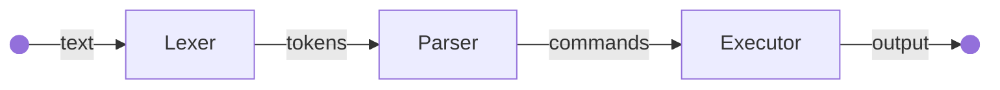

# Lobo Shell

:simple-github: [source code](https://github.com/owenmastropietro/lobo-shell)

---

## Overview

Lobo Shell is a simple Unix shell implemented in C that demonstrates the following:

- Interacting with the operating system via system calls.
- Tokenization and parsing of command-line input.
- Command pipelines.
- Redirection operators (e.g., `<`, `>`, `>>`).
- Interactive command loop.



## Key Components

### Types

=== "Token"

    ``` c
    typedef struct Token {
        TokenType type;
        char *text; // lexeme
    } Token;
    ```
    ??? example

        ``` c
        Token pipe          = { T_PIPE: "|" };
        Token redir_in      = { T_REDIR_IN: "<" };
        Token redir_out     = { T_REDIR_OUT: ">" };
        Token redir_append  = { T_REDIR_APPEND: ">>" };
        Token word          = { T_WORD: "everything_else" };
        ```

=== "TokenStream"

    ``` c
    typedef struct TokenStream {
        Token *tokens;
        int size;
    } TokenStream;
    ```
    ??? example

        ``` c
        input = "grep foo < in.txt | sort > out.txt | uniq >> append.txt";

        tokens = {
            { T_WORD: "grep" },
            { T_WORD: "foo" },
            { T_REDIR_IN: "<" },
            { T_WORD: "in.txt" },

            { T_PIPE: "|" },

            { T_WORD: "sort" },
            { T_REDIR_OUT: ">" },
            { T_WORD: "out.txt" },

            { T_PIPE: "|" },

            { T_WORD: "uniq" },
            { T_REDIR_APPEND: ">>" },
            { T_WORD: "append.txt" }
        };
        ```

=== "Command"

    !!! warning

        I am refactoring for a new Command struct.

    ``` c
    typedef struct Command {
        char **argv;
        char *infile;
        char *outfile;
        bool append;
        bool is_first;
        bool is_last;
    } Command;
    ```
    ??? example

        ``` c
        input = "grep foo < in.txt | sort > out.txt | uniq >> append.txt";

        cmd_1 = {
            argv: [ "grep", "foo", NULL ],
            infile: "in.txt",
            outfile: NULL,
            append: false,
            is_first: true,
            is_last: false
        };

        cmd_2 = {
            argv: [ "sort", NULL ],
            infile: NULL,
            outfile: "out.txt",
            append: false,
            is_first: false,
            is_last: false
        };

        cmd_3 = {
            argv: [ "uniq", NULL ],
            infile: NULL,
            outfile: "append.txt",
            append: true,
            is_first: false,
            is_last: true
        };
        ```

=== "Pipeline"

    ``` c
    typedef struct Pipeline {
        Command *cmds;
        int size;
    } Pipeline;
    ```
    ??? example

        ``` c
        input = "grep foo < in.txt | sort > out.txt | uniq >> append.txt";

        pipeline = {
            cmds: [ cmd_1, cmd_2, cmd_3 ],
            size: 3
        };
        ```

### Functions

=== "lexer"

    ``` c
    TokenStream lexer(char *line) {
        // <line> --> <tokens>
    }
    ```

=== "parser"

    ``` c
    Pipeline parse_tokens(TokenStream ts) {
        // <tokens> --> <commands>
    }
    ```

=== "executor"

    ``` c
    void execute_pipeline(Pipeline pl) {
        // execute <commands>
    }
    ```

---
