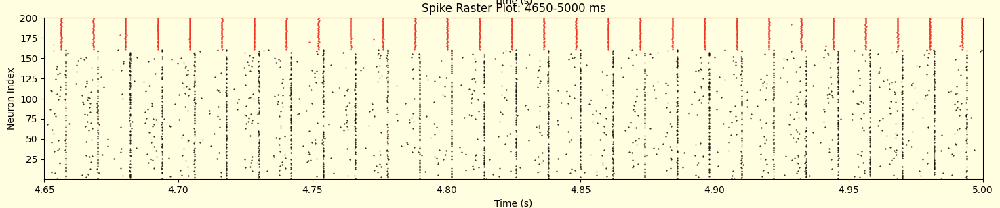
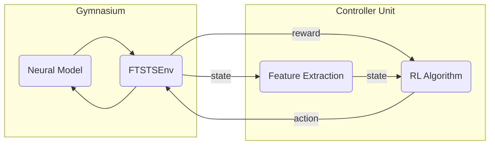

# NeuroLoop

:simple-github: [source code](https://github.com/ftsts/neuroloop)

---

## Overview


_Closed-Loop Deep-Brain Stimulation for Controlling Synchronization of Spiking Neurons._

<p align="center">
    
  <br>
  <em>The overall architecture of this work.</em>
</p>

**NeuroLoop** implements a closed-loop deep brain stimulation (cl-DBS) system to modulate neural synchronization in a computational model of the brain, optimizing the open-loop regime described in (_[Schmalz & Kumar, 2019](https://doi.org/10.3389/fncom.2019.00061)_) by implementing a Reinforcement-Learning (RL) driven feedback controller that adjusts stimulation parameters based on real-time measurements of network synchronization.

Pathological neural synchronization is a fundamental characteristic of several neurological and neuropsychiatric disorders, including Parkinson’s disease, epilepsy, and major depressive disorder, where excessive coupling between neural populations can directly contribute to debilitating symptoms such as tremor, seizures, and cognitive impairment.
Deep brain stimulation ([DBS](https://en.wikipedia.org/wiki/Deep_brain_stimulation)) is an established therapy for modulating abnormal activity, but current clinical systems often operate in an open-loop manner, delivering stimulation continuously without adapting to the brain’s evolving state.

---

## Results

<div class="grid cards" markdown>

**Training Loss** 

**Episode Reward Mean** 

**Neural Synchronization** 

**Mean Synaptic Weight** 

**Neuron Spike Times (pre-stim)** 

**Neuron Spike Times (post-stim)** 

</div>

Successfully learns to reduce neural synchronization and forces a spiking pattern.

---

## System Model

This section describes the neural system model, control objectives, and reinforcement learning formulation underlying the **NeuroLoop** framework.

### Neural System Model

**Excitatory-Inhibitory (EI) Network Model**

The neural system in this work is an Excitatory-Inihibitory (EI) Network of Leaky-Integrate-and-Fire (LIF) Neurons with Spike-Timing-Dependent Plasticity.
The following LIF model (_[Brunel & Hansel, 2006](https://doi.org/10.1162/neco.2006.18.5.1066); [Vlachos et al., 2016](https://doi.org/10.1371/journal.pcbi.1004720)_) describes a single neuron's dynamics in the EI network:

$$
\tau_m \frac{d v_i(t)}{d t} =
  - v_i(t)
  + Z_i(t)
  + \mu_i
  + \sigma_i \sqrt{\tau_m}\,\chi(t)
  + V_i(t)
$$

$$
Z_i(t) = \frac{J_\text{ij}}{C_\text{ij}} S_\text{ij}(t)
$$

$$
\tau_d \frac{d S_\text{ij}(t)}{d t}
=
- S_\text{ij}(t)
+ X_\text{ij}(t)
$$

$$
\tau_r \frac{d X_\text{ij}(t)}{d t}
=
- X_\text{ij}(t)
+ W_\text{ij}(t) \delta(t - t_\text{pre} + t_\text{delay})
$$

??? info "Description of Terms"

    > Note: $i$ and $j$ $\epsilon \{E, I\}$, denoting a neuron population.

    | Term | Units | Description
    | --- | --------------------- | -- |
    | $\tau_m$ | ms | Membrane time constant. |
    | $v_i(t)$ | mV | The neuron's membrane potential. |
    | $Z_i(t)$ | n/a | The synaptic input to the neuron population. |
    | $\mu_i + \sigma_i \sqrt{\tau_m} \chi(t)$ | n/a | Gaussian distributed baseline current to the neuron. |
    | $\chi(t)$ | n/a | White noise with a mean of 0 and variance of 1. |
    | $V_i(s)$ | mV | External stimulation to the neuron. |
    | $J_\text{ij}$ | mV | Synaptic strength between a presynaptic j-neuron and postsynaptic i-neuron.|
    | $S_\text{ij}(t)$ | n/a | The synaptic function. |
    | $\tau_d, \tau_r$ | ms | Decay and rise time constants. |
    | $X_\text{ij}$ | n/a | Input to the $i^\text{th}$ population from the $j^\text{th} population. |
    | $W_\text{ij}(t)$ | n/a | The weights of each synaptic connection (plastic). |
    | $\delta(t - t_\text{pre} + t_\text{delay})$ | n/a | The Dirac-Delta function modeling synaptic input to a postsynaptic neuron from a presynaptic neuron when the presynaptic neuron fires at time $t_\text{pre}$ with a synaptics delay of $t_\text{delay}$. |

**Spike-Timing-Dependent Plasticity (STDP) Model**

The coupling value of the plastic EI synapse ($W_\text{EI}(t)$) is governed by STDP (_[Song et al., 2000](https://doi.org/10.1038/78829); [Ebert et al., 2014](https://doi.org/10.3389/fncom.2014.00154)_), defined as follows:

$$
W_\text{IE}(t + \Delta t) = W_\text{IE}(t) + \Delta W_\text{IE}(t)
$$

$$
\Delta W_\text{IE}(t) =
  \begin{cases}
    \eta_e \alpha_\text{LTP} A_\text{post}, & \text{if } t_\text{pre} - t_\text{post} < 0 \\
    \eta_e \alpha_\text{LTD} A_\text{pre}, & \text{if } t_\text{pre} - t_\text{post} > 0
  \end{cases}
$$

$$
\tau_\text{LTP} \frac{d A_\text{post}}{d t} = - A_\text{post} + A_0 \delta(t - t_\text{post})
$$

$$
\tau_\text{LTD} \frac{d A_\text{pre}}{d t} = - A_\text{pre} + A_0 \delta(t - t_\text{pre})
$$

??? info "Description of Terms"

    | Term | Units | Description
    | --- | --------------------- | -- |
    | $W_\text{ij}(t)$ | n/a | The weights of each synaptic connection (plastic). |
    | $\Delta W_\text{IE}$ | n/a | The change in synaptic weight determined by the spike-time of a presynaptic ($t_\text{pre}$) and postsynaptic ($t_\text{post}$) neuron. |
    | $\eta_e$ | n/a | The rate at which the E-to-I synaptic coupling changes. |
    | $\alpha_{LTP}, \alpha_{LTD}$ | n/a | The relative contributions of LTP and LTD to $\Delta W_\text{IE}$. |
    | $\tau_\text{LTP}, \tau_\text{LTD}$ | ms | STDP time constants defining the size of the long-term potentiation and long-term depression time window. |
    | $A_0$ | n/a | Fixed jump added to a trace at each spike. |
    | $A_\text{pre}$ | n/a | Presynaptic spike trace (decaying memory of recent pre spikes). |
    | $A_\text{post}$ | n/a | Postsynaptic spike trace (decaying memory of recent post spikes). |

### Control Objective

The primary objective of **NeuroLoop** is to supress pathological neural synchronization while minimizing the required stimulation intensity to do so.
Excessive stimulation amplitude is undesirable due to increased energy consumption and the risk of stimulation-induced side effects.
Control is implemented in a closed-loop manner, where stimulation parameters are continuously adjusted based on real-time observations of neural activity.

At each control timestep, stimulation amplitude is applied to the neural system according to the FTSTS motif.
The resulting neural dynamics are observed, enabling the controller to respond to changes in network state.
The control objective and feedback signals are formalized in the following section.

### Problem Formulation

**NeuroLoop** is formulated as a Markov Decision Process ([MDP](https://en.wikipedia.org/wiki/Markov_decision_process)) defined by the tuple <nobr>($S, A, P, R$)</nobr>.

!!! info "MDP Terms"

    $S$ - The state space; encodes the feedback signals.  
    $A$ - The action space; encodes the control signals (canonical DBS parameters).  
    $P$ - The transition dynamics.  
    $R$ - The reward function; encodes the control objective.

### Environment

**NeuroLoop** wraps the [neural model](#neural-system-model) described above in a [Gymnasium](https://gymnasium.farama.org/)-style environment for developing a Reinforcement Learning ([RL](https://en.wikipedia.org/wiki/Reinforcement_learning)) controller as depicted in the figure at the top of this page.
This environment structure provides a standard interface to the action space, state space, reward function, and episode configuration for the RL agent to interact with.



#### Action Space

| Index | Action      | Unit   | Range     |
| :---: | ----------- | ------ | --------- |
|   0   | Amplitude   | mV     | [10, 200] |
|   1   | Frequency   | Hz     | [5, 128]  |
|   2   | Pulse Width | $\mu$s | [50, 500] |

The agent’s action space consists of a single continuous variable corresponding to the stimulation amplitude applied within the FTSTS framework.
The remaining canonical DBS parameters (i.e., frequency and pulse width) are fixed according to the FTSTS motif, allowing the effects of adaptive amplitude modulation to be isolated and analyzed.
Actions are represented in a normalized space and linearly rescaled to the biophysically meaningful stimulation range prior to application.
For example, the stimulation amplitude is a continuous variable internally normalized to the range [−1, 1] and mapped to the suggested range of [10, 200].

#### State Space

| Index | Observation                            | Unit | Range     |
| :---: | -------------------------------------- | ---- | --------- |
|   0   | Synchrony                              | n/a  | [0, 1]    |
|   1   | Mean Excitatory Membrane Voltage       | mV   | [−80, 50] |
|   2   | Std. Excitatory Membrane Voltage       | mV   | [0, 30]   |
|   3   | Mean Inhibitory Membrane Voltage       | mV   | [−80, 50] |
|   4   | Std. Inhibitory Membrane Voltage       | mV   | [0, 30]   |
|   5   | Mean $I \rightarrow E$ Synaptic Weight | n/a  | [0, 1]    |

$$
s_t = (synchrony, \mu_{V_E}, \sigma_{V_E}, \mu_{V_I}, \sigma_{V_I}, \mu_{W_\text{EI}})
$$

At each control timestep, the reinforcement learning agent observes a compact state vector derived from population-level neural statistics.
All feedback signals are aggregated over a fixed temporal window and standardized prior to control by subtracting a running mean and dividing by a running standard deviation computed over interaction trajectories.
This normalization ensures that each state dimension has approximately zero mean and unit variance, stabalizing learning dynamics across stimulation regimes.

The **synchrony** measurement used here is a per-timestep estimate of voltage-based population synchrony suitable for closed-loop control.

$$
synchrony =
  \sqrt{\frac
    {\sigma_t(\bar{v}(t))}
    {\frac{1}{N} \sum_{i=1}^N \sigma_t(v_i(t))}
  }
$$

$$
\bar{v}(t) = \frac{1}{N} \sum_{i=1}^N v_i(t)
$$

where $v_i(t)$ is the membrane potential of neuron $i$ and $\bar{v}(t)$ is the population mean voltage.
Values near zero indicate asynchronous activity while larger values indicate increased levels of synchronization of spiking patterns.
While less accurate, this synchrony index is an efficient estimation of population-level synchrony that can be used as a feedback signal each step of the episode.

The **mean population-level membrane potentials**, ($\mu_{V_E}$, $\mu_{V_I}$), help define fragile vs robust network states relative to the firing threashold.
Without these feedback signals, highly excitable networks exhibiting high levels of synchrony may receive additional stimulation to reduce the synchronization at the cost of destabalizing the network into runaway firing.

The **standard deviation of population-level membrane potentials**, ($\sigma_{V_I}$, $\sigma_{V_I}$), offer insight into the coherence of the network.
Without these feedback signals, we may fail to disambiguate two main modes of reducing synchrony: descynchronization and silencing.
The desired desynchronization involves breaking phase-locked oscillations while silencing involves entirely suppressing activity.

The inclusion of mean and variance signals of exchitatory and inhibitory membrane potentials allows inference of the stability and coherence of the neural population, resolving ambiguities that cannot be captured by sunchrony measueres alone.

The **mean inhibitory-to-excitatory synaptic coupling** value, $\mu_{W_\text{IE}}$, of the plastic E-to-I synapse is governed by the underlying STDP model.
This feedback signal represents the effective strength of the inhibitory regulation exerted on excitatory neurons, capturing slower-evolving network properties that influence stability and synchrony.
Additionally, as shown in the graph below, the mean synaptic weight is highly correlated with the ground-truth synchrony measurement - the Kuramoto Order Parameter (_[Kuramoto, 1984](https://link.springer.com/book/10.1007/978-3-642-69689-3); [Daido, 1992](https://doi.org/10.1143/ptp/88.6.1213); [Tass, 2007](https://link.springer.com/book/10.1007/978-3-540-38161-7); [Ebert et al., 2014](https://doi.org/10.3389/fncom.2014.00154)_).
Incorporating this feedback signal enables stimulation to be adapted in response to changes in synaptic interactions rather than instantaneous activity alone and serves as a secondary strong proxy for the true synchrony index.

<p align="center">
    <!--  -->
    
  <br>
  <em>Correlating average synaptic weight with the Kuramoto Order Parameter.</em>
</p>

#### Reward Function

The reward function consists of a dense per-timestep component and an additional terminal penalty based on the Kuramoto Order Parameter, balancing synchronization suppression against stimulation cost:

$$
R(t) =
  \begin{cases}
      -\alpha r_1 - \beta r_2 - \gamma r_3, & t < T \\
      -\alpha r_1 - \beta r_2 - \gamma r_3 - \delta r_4, & \text{t = T}
  \end{cases}
$$

where $r_1$, $r_2$, $r_3$, and $r_4$ are respectively identified as “synchrony,” “squared stimulation amplitude,” "mean synaptic weight," and “Kuramoto Order (Synchrony) Parameter.”
Weighting coefficients $\alpha$, $\beta$, $\gamma$, and $\delta$ help control the trade-off between desynchronization performance and stimulation intensity, encouraging the agent to suppress pathological synchronization while avoiding unnecessarily large stimulation amplitudes.
Additionally, the reward signal is normalized using running estimates of its mean and variance.

The **synchrony** measurement used for the first reward component is the same as that described in the [state space](#state-space).
This synchrony term directly encodes the control objective of descynchronization.
Penalizing high degrees of synchrony aligns the learned objective with clinical findings that excessive population synchrony is linked to pathological motor symptoms.

$$
r_1 = \text{synchrony}_t
$$

The quadratic penalty on **stimulation amplitude** reflects constraints on DBS energy consumption and safety.
Squaring the amplitude disproportionaly penalizes larger stimulation values, further encouraging minimal energy usage.

$$
r_2 = a_t^2
$$

The **mean synaptic weight**, $\mu_{W_\text{IE}}$, is the same as that described in the [state space](#state-space).
As mentioned in that section, this state variable captures network adaptation governed by STDP, not just instantaneous dynamics.
Penalizing inhibitory-to-excitatory synaptic coupling discourages control strategies that rely on long-term synaptic adjustments rather than short-term modulation of neural activity.
This promotes stimulation policies that achieve desynchronization while preserving stable network connectivity.

$$
r_3 = \mu_{W_\text{IE}}
$$

The final component of the reward function is another measurement of synchrony.
As mentioned in the [state space](#state-space), the per-step voltage-based synchrony measurement is useful for dense feedback.
It is a more efficient but less accurate proxy for the true synchrony measurement.
A more accurate measurement of the synchrony level can be obtained by computing the **Kuramoto Order Parameter (KOP)** based on the spike times of neurons in the excitatory population.
As used in this work, the KOP is a spike-time phase-based approach for computing synchrony which, in DBS, is fundamentally about phase locking.
It measures the degree of phase locking between oscillatory neural activity across the population.
While it is more accurate, it is not feasible to compute at every timestep of the simulation.
It is therefore computed at the end of each episode as a sparse reward component.

$$
r_4 =
  \begin{cases}
      \text{KOP}, & t = T \\
      0, & \text{otherwise}
  \end{cases}
$$

$$
\text{KOP}(t)e^{i\psi(t)} = \frac{1}{N_E} \sum_{k=1}^{N_E} e^{i\phi_k(t)}
$$

$$
\phi_k(t) = \frac{2\pi(t_{k,i+1}-t)}{t_{k,i+1}-t_{k,i}}
$$

Jointly, the final reward signal is normalized using running estimates of its mean and variance, maintaining a consistent reward scale and stabalizing training.

<!-- \section{Learning Algorithm}
\label{sec:learning-algorithm}

NeuroLoop employs Proximal Policy Optimization (PPO \cite{ppo}), an on-policy policy-gradient algorithm well-suited for stable learning in continuous control problems. PPO combines ideas from Advantage Actor-Critic (A2C) and Trust Region Policy Optimization (TRPO \cite{trpo}) to optimize a stochastic policy while constraining successive policy updates to remain close to the current policy, preventing destructive updates that can destabilize learning in sensitive environments such as neural populations.

The control policy is parameterized as a neural network $\pi_\theta(a_t \mid s_t)$ that maps normalized state observations to a probability distribution over continuous stimulation amplitudes. At each control timestep, the policy samples an action from the distribution, exploiting previously learned stimulation strategies or exploring new stimulations strategies. Simultaneously, a separate value function $V_\theta(s_t)$ is learned to estimate the expected return from a given state and to reduce the variance in the policy gradient updates. During each episode of training, the agent interacts with the neural environment by observing the current state, selecting stimulation amplitudes, and receiving rewards defined in Section~\ref{sec:reward-function}. Sampled experience trajectories are then collected and used to update the policy and value function parameters via stochastic gradient ascent on PPO's clipped surrogate objective. This objective limits the magnitudes of policy updates by clipping the probability ratio between the new and old policies, ensuring stability \cite{spinning-up}.

\begin{equation}
\label{eq:ppo-clip}
    \theta_{k+1} =
    \arg \max_{\theta} E_{s, a \sim \pi_{\theta_k}} [L(s, a, \theta_k, \theta)]
\end{equation}

PPO was selected for its support for continuous action spaces without requiring complex second-order optimization, its clipped objective which makes it robst to reward scaling and the stochastic dynamics inherent in spiking neural simulations, and its demonstrated performance in a wide range of control tasks where safety, training stability, and smooth control signals are important \cite{ppo-studies}. All training is performed in silico using the Stable-Baselines3 framework \cite{stable-baselines}. Learned policies are evaluated without exploration noise to analyze closed-loop stimulation performance. -->

---

## API

`#!python class gymnasium.Env`  
`#!python class dbsenv.envs.DBSEnv(gymnasium.Env)`  
`#!python class dbsenv.envs.FTSTSEnv(DBSEnv)`

The main Gymnasium class for implementing Reinforcement Learning Agent environments.

The class encapsulates an environment with arbitrary behind-the-scenes dynamics through the `step()` and `reset()` methods.

The main API methods that users of this class need to know are:

- [`step()`](#dbsenvstep) - Updates an environment by taking an action and returning the
  agent's observation, the reward for taking that action, whether the environment
  has terminated or truncated, and auxiliary diagnostic information.
- [`reset()`](#dbsenvreset) - Resets the environment to an initial state, returning an initial observation and auxiliary diagnostic
  information. Required before the first call to `step()`.
- `render()` - Renders the environment to help visualize what the agent sees.
- `close()` - Closes the environment and frees up resources.

---

### Methods

#### DBSEnv.init

```py
DBSEnv(
    sim_config:   SimConfig,
    model_class:  type[NeuralModel],
    model_params: dict | None = None,
    render_mode:  str | None = None
)
```

PARAMETERS:

- `sim_config` – Simulation configuration (timing, sampling, resolution)
- `model_class` – Neural model class implementing the spiking dynamics
- `model_params` – Optional model-specific keyword arguments
- `render_mode` – Optional Gymnasium render mode

#### DBSEnv.reset

```py
DBSEnv.reset(
    seed:    Optional[int] = None,
    options: Optional[dict] = None
) -> tuple[ObsType, dict[str, Any]]:
```

Resets the environment to an initial state (reinitializing plasticity,
stimulation timing, internal counters, etc.), returning an initial observation
and info.

PARAMETERS:

- `seed (optional int)` – The seed that is used to initialize the environment's
  PRNG (_np_random_) and the read-only attribute _np_random_seed_.
- `options (optional dict)` – Additional information to specify how the
  environment is reset.

RETURNS:

- `observation (ObsType)` – Observation of the initial state.
- `info (dict)` – Auxiliary diagnostic information complementing the observation.

#### DBSEnv.step

```py
DBSEnv.step(
    action: ActType
) -> tuple[ObsType, SupportsFloat, bool, bool, dict[str, Any]]
```

Runs one timestep of the environment's dynamics using the agent's actions.

PARAMETERS:

- `action (ActType)` – an action provided by the agent to update the environment state.

RETURNS:

- `observation (ObsType)` – Population-level neural statistics
- `reward (SupportsFloat)` – The reward as a result of taking the action, encouraging (de)synchronization
- `terminated` – Episode termination flag
- `truncated` – Truncation flag (unused)
- `info` – Diagnostic data (e.g., spike timing)

---

### Attributes

#### DBSEnv.action_space

The actions are continuous and normalized internally before being mapped to
biophysically meaningful stimulation parameters.

See [action space](#action-space)

#### DBSEnv.observation_space

Observations are aggregated over a fixed temporal window and normalized
to ensure stable learning dynamics across stimulation regimes.

See [state space](#state-space)

---
