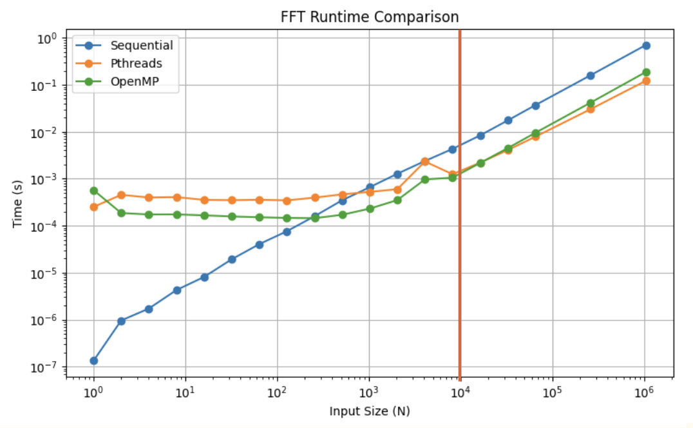
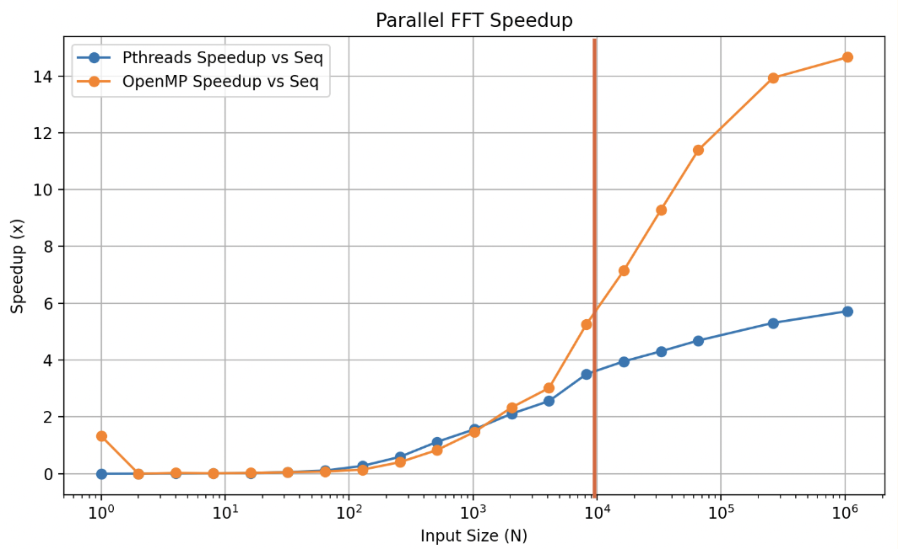
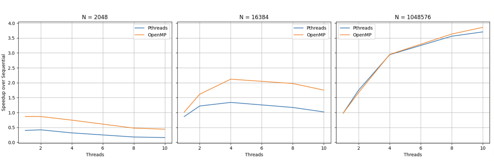

# Parallel FFT

:simple-github: [source code](https://github.com/owenmastropietro/pfft)

---

## Overview

_Performance Analysis of Parallel FFT Implementations._


**ParallelFFT** implements and evaluates multiple parallelization strategies for
the Cooley-Tukey Fast Fourier Transform (FFT) to study the performance tradeoffs.
A sequential baseline is compared against **OpenMP**, **POSIX Threads (pthreads)**,
and **C++ `#!c++ std::thread`** variants, with a focus on scalability, memory
behavior, and microarchitectural efficiency.

Performance is evaluated across increasing input sizes and thread counts,
analyzing **runtime**, **speedup**, **cache behavior**, and **branch behavior**
to highlight how each threading model interacts with modern CPU architectures.

See the [What is the FFT](#what-is-the-fft) section below for a brief primer on
the Fast Fourier Transform and its use cases.  
I have another project that shows the FFT in action, transforming speech into
feature-rich frequency bins for a simple [FPGA Speech Recognizer](../projects/smalltalk.md)!

FFT Implementations:

- `seq` - Sequential baseline
- `omp` - OpenMP
- `pth` - POSIX Threads (pthreads)
- `cth` - C++ `#!c++ std::thread`

??? note "System Configuration"

    ``` sh
    % sysctl -a | grep cache
    ...
    hw.perflevel0.l1icachesize:	196608
    hw.perflevel0.l1dcachesize: 131072
    hw.perflevel0.l2cachesize: 	16777216
    hw.perflevel1.l1icachesize: 131072
    hw.perflevel1.l1dcachesize: 65536
    hw.perflevel1.l2cachesize: 	4194304
    ...
    hw.cachelinesize: 128
    hw.l1icachesize:  131072
    hw.l1dcachesize:  65536
    hw.l2cachesize:   4194304
    ...
    ```

    !!! note ""

        - Apple M2 (ARM64 Silicon)
        - Cores:
            - 10 total
            - 6 performance
            - 4 efficiency
        - Cache (perf-cores):
            - L1I: 192 KB
            - L1D: 128 KB
            - L2: 16 MB

---

## Results

_Vertical lines approximate cache expenditure._

<div class="grid cards" markdown>

**Runtime** 

**Speedup** 

**Cache Misses** 

**Branch Mispredictions** 

**Runtime vs. Cache Misses** 

**Speedup vs. Thread Count** 

</div>

---

## Key Components

---

### FFT Implementations

`#!c++ seq::fft` - sequential baseline  
`#!c++ omp::fft` - parallel OpenMP  
`#!c++ pth::fft` - parallel pthreads  
`#!c++ cth::fft` - parallel C++ standard threads

=== "seq::fft"

    ``` c++ linenums="1"
    void fft(std::vector<cd> &seq) {
        const size_t n = seq.size();
        bit_reverse_permute(seq);

        for (size_t len = 2; len <= n; len <<= 1) { // stage size
            double ang = -2 * PI / len;
            cd wlen(std::cos(ang), std::sin(ang)); // Euler's root of unity

            for (size_t i = 0; i < n; i += len) {
                cd w(1); // twiddle factor
                for (size_t j = 0; j < len / 2; ++j) {
                    cd a = seq[i + j];
                    cd wb = seq[i + j + len / 2] * w;
                    seq[i + j] = a + wb;
                    seq[i + j + len / 2] = a - wb;
                    w *= wlen;
                }
            }
        }
    }
    ```

=== "omp::fft"

    ``` c++ linenums="1" hl_lines="9"
    void fft(std::vector<cd> &seq) {
        const size_t n = seq.size();
        bit_reverse_permute(seq);

        for (size_t len = 2; len <= n; len <<= 1) { // stage size
            double ang = -2 * PI / len;
            cd wlen(std::cos(ang), std::sin(ang)); // Euler's root of unity

    #pragma omp parallel for schedule(static)
            for (long long i = 0; i < static_cast<long long>(n); i += len) {
                cd w(1);
                for (size_t j = 0; j < len / 2; ++j) {
                    cd a = seq[i + j];
                    cd wb = seq[i + j + len / 2] * w;
                    seq[i + j] = a + wb;
                    seq[i + j + len / 2] = a - wb;
                    w *= wlen;
                }
            }
        }
    }
    ```

=== "pth::fft"

    ``` c++ linenums="1"
    inline void fft(std::vector<cd> &seq, size_t num_threads) {
        const size_t n = seq.size();
        bit_reverse_permute(seq);

        for (size_t len = 2; len <= n; len <<= 1) {
            double ang = -2 * PI / len;
            cd wlen(std::cos(ang), std::sin(ang));

            std::vector<std::thread> threads;
            threads.reserve(num_threads);

            size_t chunk = n / (len * num_threads);
            if (chunk == 0) {
                chunk = 1;
            }

            for (size_t t = 0; t < num_threads; ++t) {
                threads.emplace_back([&, t]() {
                    size_t start = t * chunk * len;
                    size_t end = std::min(start + chunk * len, n);

                    for (size_t i = start; i < end; i += len) {
                        cd w(1);
                        for (size_t j = 0; j < len / 2; ++j) {
                            cd u = seq[i + j];
                            cd v = seq[i + j + len / 2] * w;
                            seq[i + j] = u + v;
                            seq[i + j + len / 2] = u - v;
                            w *= wlen;
                        }
                    }
                });
            }

            for (auto &th : threads) {
                th.join();
            }
        }
    }
    ```

=== "cth::fft"

    ``` c++ linenums="1"
    inline void fft(std::vector<cd> &seq, size_t num_threads) {
        const size_t n = seq.size();
        bit_reverse_permute(seq);

        for (size_t len = 2; len <= n; len <<= 1) {
            double ang = -2 * PI / len;
            cd wlen(std::cos(ang), std::sin(ang));

            std::vector<std::thread> threads;
            threads.reserve(num_threads);

            size_t chunk = n / (len * num_threads);
            if (chunk == 0) {
                chunk = 1;
            }

            for (size_t t = 0; t < num_threads; ++t) {
                threads.emplace_back([&, t]() {
                    size_t start = t * chunk * len;
                    size_t end = std::min(start + chunk * len, n);

                    for (size_t i = start; i < end; i += len) {
                        cd w(1);
                        for (size_t j = 0; j < len / 2; ++j) {
                            cd u = seq[i + j];
                            cd v = seq[i + j + len / 2] * w;
                            seq[i + j] = u + v;
                            seq[i + j + len / 2] = u - v;
                            w *= wlen;
                        }
                    }
                });
            }

            for (auto &th : threads) {
                th.join();
            }
        }
    }
    ```

---

### Benchmarking

While basic metrics such as runtime and speedup can be derived from source code,
the microarchitectural metrics such as cache or branch behavior require additional
benchmark harnesses such as external scripting or profilers. Given my aforementioned
system configuration, I used [Apple Instruments](https://developer.apple.com/tutorials/instruments)
to access data provided by the PMUs.  
It proved to be less convenient than Linux's `perf` CLI tool,
but neither virtualization nor emulation provided sufficient access to the PMUs.

```c++ title="Timing FFTs" linenums="1"
template <typename F>
double time_fft(F fft_func, const std::vector<cd> &seq, int runs = 5) {
    double total = 0.0;
    for (int r = 0; r < runs; ++r) {
        auto data = seq;

        auto start = Clock::now();
        fft_func(data);
        auto end = Clock::now();

        total += std::chrono::duration<double>(end - start).count();
    }

    return total / runs;
}
```

---

## What is the FFT

- `FT` - Fourier Transform
- `DFT` - Discrete Fourier Transform
- `FFT` - Fast Fourier Transform

The FFT is an efficient algorithm for computing the DFT, a discrete version of the FT.  
That is, the FFT is an efficient algorithm for converting from the _time-domain_ to the _frequency-domain_.

The FT is a transform that maps an input function to another function that describes
the extent (magnitude) to which various frequencies are present in the input function.  
That is, the FT decomposes a signal into its corresponding frequency components.

!!! example

    I press 5 notes on a piano, making a chord.<br>
    The chord is a single composite frequency containing 5 pure frequencies.

    An untrained ear hears the chord as one single sound despite the 5 notes.<br>
    However, when we pass it through the FT, it is able to disambiguate which 5 notes I pressed.

    This is further illustrated in the figure below.

The idea behind the _brute force_ implementation of such an algorithm is to simply
correlate all your frequencies with the input signal - $O(N^2)$.

The FFT is able to reduce this to $O(N \log N)$ via a DP*ish* approach to avoid
recomputing overlapping complex exponentials/partial sums in a _divide-and-conquer combine_ fashion.

This _divide-and-conquer combine_ approach stems from the observation that
the DFT of a length-N signal can be decomposed into two length-$\frac{N}{2}$ DFTs
of the even-indexed and odd-indexed samples (with appropriate _twiddle factors_).

<div class="grid" markdown>


Example decomposition of an input signal (e.g., a chord) into its 5 corresponding
pure frequencies.  
A given point in the input signal is the sum of the corresponding
point in the derived pure frequencies.


Another example, illustrating the conversion from the time to the frequency domain.  
Notice the peaks at 1 and 10 Hz corresponding to the 1x and 10x components of the input signal.

</div>

This is my attempt at summarizing the hours of information I learned from the following key resources:

- [https://cp-algorithms.com/algebra/fft.html](https://cp-algorithms.com/algebra/fft.html)
- [3Blue1Brown](https://www.youtube.com/watch?v=spUNpyF58BY)
- [Reducible FFT](https://www.youtube.com/watch?v=h7apO7q16V0)
- [Reducible DFT](https://www.youtube.com/watch?v=yYEMxqreA10)
- [Steve Brunton](https://www.youtube.com/watch?v=E8HeD-MUrjY)

!!! warning "todo"

    I want to make a diagram for the bit reversal step of the iterative FFT.

To see the FFT in action, check out [SmallTalk](../projects/smalltalk.md) - my other project utilizing
the FFT for feature extraction in a simple FPGA-driven Speech Recognizer.

!!! note

    Typical use cases of the FFT involve smaller input sizes,
    typically around 512, 1024, or 2048.

    As demonstrated in this project, 1024-point FFTs never witness the advantages
    of parallelism as implemented here (i.e., performing butterfly operations in
    parallel) because thread management amortizes the overhead.

    For this reason, the FFT is almost never parallelized in this fashion.
    Instead, multilpe FFTs are parallelized. In multi-channel audio processing,
    or in multi-channel image processing (e.g., RGB), you must compute a 2D FFT
    on each channel. In practice, the FFT is parallelized per-channel.

    However, when implemented in hardware, the FFT does benefit from butterfly-level
    parallelization.<br>
    Check out my project [SmallTalk](../projects/smalltalk.md)
    to learn more about this!

---
