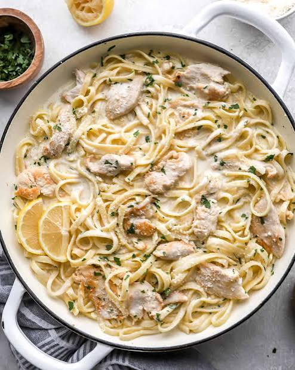

# Chicken Alfredo

A creamy Alfredo sauce made with butter, garlic, cream, Parmesan, and mozzarella, served with chicken and pasta.

> :octicons-stopwatch-16: **Prep** 10 min  
> :octicons-stopwatch-16: **Cook** 30 min  
> :octicons-stopwatch-16: **Total** 40 min  
> :octicons-people-16: **Serves** 4

## Ingredients

- **2 cloves** garlic, minced
- **¼ tsp** black pepper
- **½ cup** butter
- **2 cups** heavy cream
- **½ cup** Parmesan cheese, grated
- **¾ cup** mozzarella cheese, shredded

## Instructions

1. **Melt the butter.** Melt the butter in a large skillet over medium-high heat.
2. **Add the garlic and cream.** Add the garlic, heavy cream, and black pepper. Stir to combine.
3. **Simmer.** Reduce the heat and simmer for **10–15 minutes**, stirring occasionally.
4. **Add the Parmesan.** Stir in the Parmesan cheese and cook for about **8 minutes**, stirring frequently, until the sauce thickens.
5. **Add the mozzarella.** Stir in the mozzarella and cook for another **3 minutes**, until melted and smooth.
6. **Serve.** Toss the Alfredo sauce with cooked chicken and pasta, then serve immediately.
